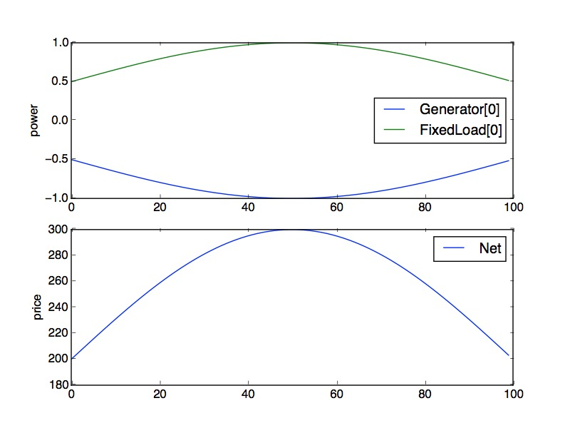

.. Dynamic Energy Management documentation master file, created by
   sphinx-quickstart on Mon Aug  1 10:07:28 2016.
   You can adapt this file completely to your liking, but it should at least
   contain the root `toctree` directive.

Get Started
===========

Introduction
------------

Installation
------------

Basic Usage
-----------

.. code:: python

  import numpy as np
  from dem import *

  T = 100
  p_load = (np.sin(np.pi*np.arange(T)/T)+1)*0.5

  load = FixedLoad(p=p_load)
  gen = Generator(p_max=2, p_min=-0.1, alpha=100, beta=100)
  net = Net([load.terminals[0], gen.terminals[0]])
  network = Group([load, gen], [net])

  network.init_problem(time_horizon=T)
  network.problem.solve()
  network.results.plot()
..

