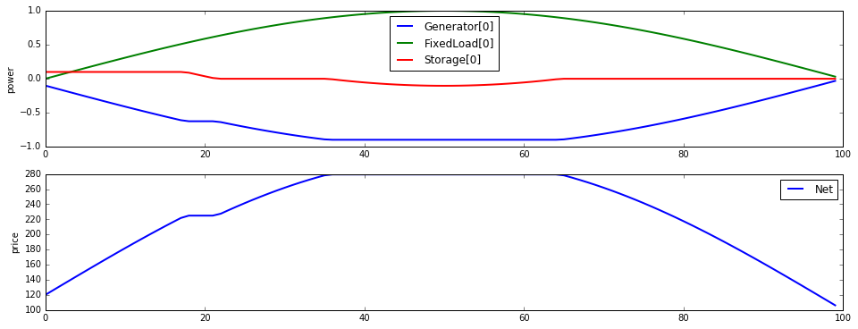
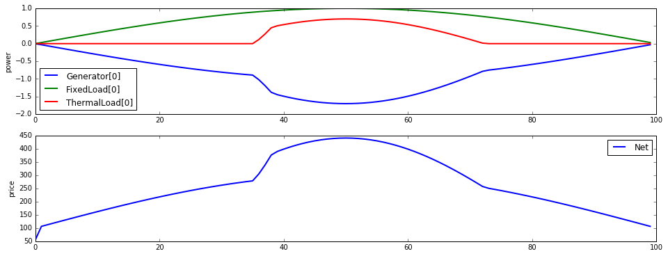
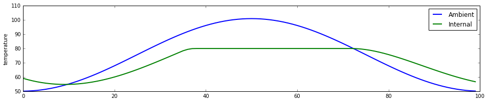

Dynamic power flow
==================

.. code:: python

    %matplotlib inline
    import matplotlib.pyplot as plt
    import matplotlib
    import numpy as np
    
    from dem import *
    
    matplotlib.rc("figure", figsize=(16,6))
    matplotlib.rc("lines", linewidth=2)
    
    T = 100
    p_load = np.sin(np.pi*np.arange(T)/T)

Basic examples
--------------

Time-varying load
~~~~~~~~~~~~~~~~~

.. code:: python

    load = FixedLoad(power=p_load)
    gen = Generator(power_max=2, power_min=-0.1, alpha=100, beta=100)
    net = Net([load.terminals[0], gen.terminals[0]])
    network = Group([load, gen], [net])
    
    network.init_problem(time_horizon=T)
    network.problem.solve()
    network.results.plot()

.. parsed-literal::

    array([<matplotlib.axes._subplots.AxesSubplot object at 0x108660d10>,
           <matplotlib.axes._subplots.AxesSubplot object at 0x10868bad0>], dtype=object)

.. image:: dynamic_files/dynamic_4_1.png

Storage
~~~~~~~

.. code:: python

    load = FixedLoad(power=p_load)
    gen = Generator(power_max=2, alpha=100, beta=100)
    storage = Storage(discharge_max=0.4, charge_max=0.1, energy_max=2)
    net = Net([load.terminals[0], gen.terminals[0], storage.terminals[0]])
    network = Group([load, gen, storage], [net])
    
    network.init_problem(time_horizon=T)
    network.problem.solve()
    network.results.plot()
    
    fig, ax = plt.subplots(nrows=1, ncols=1, figsize=(16,3))
    ax.plot(storage.energy.value)
    ax.set_ylabel("stored energy")

.. parsed-literal::

    <matplotlib.text.Text at 0x108e43c10>

Deferrable load
~~~~~~~~~~~~~~~

.. code:: python

    load = FixedLoad(power=p_load)
    gen = Generator(power_max=2, alpha=100, beta=100)
    deferrable = DeferrableLoad(time_start=50, energy=20, power_max=0.8)
    net = Net([load.terminals[0], gen.terminals[0], deferrable.terminals[0]])
    network = Group([load, gen, deferrable], [net])
    
    network.init_problem(time_horizon=T)
    network.problem.solve()
    network.results.plot()

.. parsed-literal::

    array([<matplotlib.axes._subplots.AxesSubplot object at 0x1086a4450>,
           <matplotlib.axes._subplots.AxesSubplot object at 0x109402cd0>], dtype=object)

.. image:: dynamic_files/dynamic_8_1.png

Thermal load
~~~~~~~~~~~~

.. code:: python

    temp_amb = (np.sin(np.pi*np.arange(T)/T) + 1e-2).reshape(-1,1)**2*50+50
    
    load = FixedLoad(power=p_load)
    gen = Generator(power_max=2, alpha=100, beta=100)
    thermal = ThermalLoad(
        temp_init=60, temp_amb=temp_amb, temp_min=None, temp_max=80,
        power_max=2, amb_conduct_coeff=0.1, efficiency=3, capacity=1)
    net = Net([load.terminals[0], gen.terminals[0], thermal.terminals[0]])
    network = Group([load, gen, thermal], [net])
    
    network.init_problem(time_horizon=T)
    network.problem.solve()
    network.results.plot()
    
    fig, ax = plt.subplots(nrows=1, ncols=1, figsize=(16,3))
    ax.plot(temp_amb, label="Ambient")
    ax.plot(thermal.temp.value, label="Internal")
    ax.set_ylabel("temperature")
    ax.legend()

.. parsed-literal::

    <matplotlib.legend.Legend at 0x109967150>

