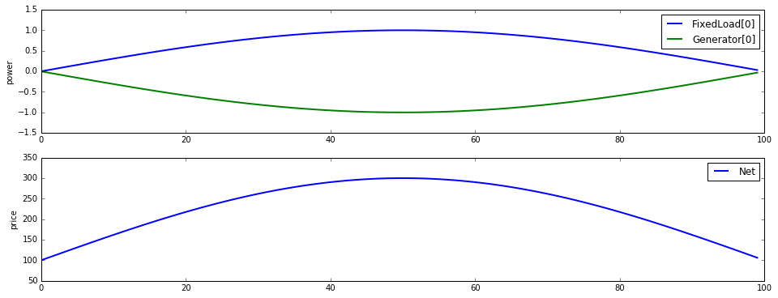
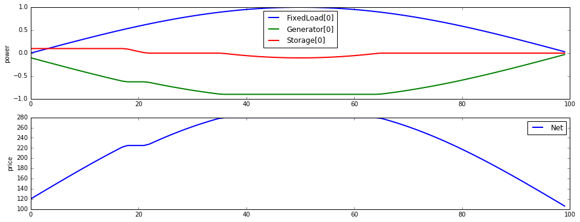
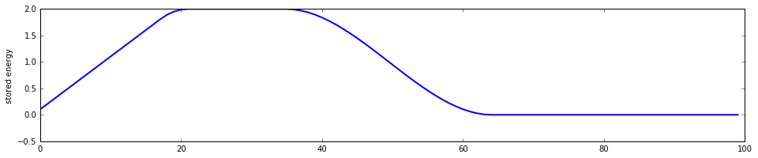
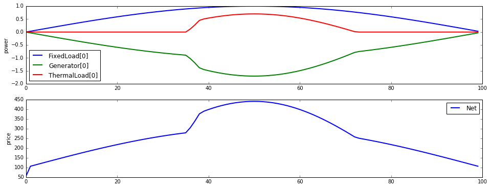

Dynamic power flow
==================

.. code:: python

    %matplotlib inline
    import matplotlib.pyplot as plt
    import matplotlib
    import numpy as np
    
    from dem import *
    
    matplotlib.rc("figure", figsize=(16,6))
    matplotlib.rc("lines", linewidth=2)
    
    T = 100
    p_load = np.sin(np.pi*np.arange(T)/T)

Basic examples
--------------

.. code:: python

    from dem import network
    from dem import devices
    reload(network)
    reload(devices)
    
    CurtailableLoad = devices.CurtailableLoad
    FixedLoad = devices.FixedLoad
    Generator = devices.Generator
    Group = network.Group
    Net = network.Net
    Storage = devices.Storage
    TransmissionLine = devices.TransmissionLine
    run_mpc = network.run_mpc

Time-varying load
~~~~~~~~~~~~~~~~~

.. code:: python

    load = FixedLoad(power=p_load)
    gen = Generator(power_max=2, power_min=-0.1, alpha=100, beta=100)
    net = Net([load.terminals[0], gen.terminals[0]])
    network = Group([load, gen], [net])
    
    network.init_problem(time_horizon=T)
    network.problem.solve()
    network.results.plot()

.. parsed-literal::

    array([<matplotlib.axes._subplots.AxesSubplot object at 0x108660d10>,
           <matplotlib.axes._subplots.AxesSubplot object at 0x10868bad0>], dtype=object)

Storage
~~~~~~~

.. code:: python

    load = FixedLoad(p=p_load)
    gen = Generator(p_max=2, alpha=100, beta=100)
    storage = Storage(p_min=-0.4, p_max=0.1, E_max=2)
    
    net = Net([load.terminals[0], gen.terminals[0], storage.terminals[0]])
    network = Group([load, gen, storage], [net])
    network.optimize(time_horizon=N)
    network.plot_results()
    
    fig, ax = plt.subplots(nrows=1, ncols=1, figsize=(16,3))
    ax.plot(storage.energy.value)
    ax.set_ylabel("stored energy")

.. parsed-literal::

    <matplotlib.text.Text at 0x10e763a90>

Deferrable load
~~~~~~~~~~~~~~~

.. code:: python

    load = FixedLoad(p=p_load)
    gen = Generator(p_max=2, alpha=100, beta=100)
    deferrable = DeferrableLoad(t_start=50, E=20, p_max=0.8)
    
    net = Net([load.terminals[0], gen.terminals[0], deferrable.terminals[0]])
    network = Group([load, gen, deferrable], [net])
    network.optimize(time_horizon=N)
    network.plot_results()

.. parsed-literal::

    array([<matplotlib.axes._subplots.AxesSubplot object at 0x10d42f810>,
           <matplotlib.axes._subplots.AxesSubplot object at 0x10d488850>], dtype=object)

.. image:: dynamic_files/dynamic_9_1.png

Thermal load
~~~~~~~~~~~~

.. code:: python

    T_ambient = (np.sin(np.pi*np.arange(N)/N) + 1e-2).reshape(-1,1)**2*50+50
    
    load = FixedLoad(p=p_load)
    gen = Generator(p_max=2, alpha=100, beta=100)
    thermal = ThermalLoad(
        T_init=60, T_ambient=T_ambient, T_min=None, T_max=80,
        p_max=2, conduct_coeff=0.1, efficiency=3., capacity=1.)
    
    net = Net([load.terminals[0], gen.terminals[0], thermal.terminals[0]])
    network = Group([load, gen, thermal], [net])
    network.optimize(time_horizon=N)
    network.plot_results()
    
    fig, ax = plt.subplots(nrows=1, ncols=1, figsize=(16,3))
    ax.plot(T_ambient, label="Ambient")
    ax.plot(thermal.T.value, label="Internal")
    ax.set_ylabel("temperature")
    ax.legend()

.. parsed-literal::

    <matplotlib.legend.Legend at 0x11093c650>

.. image:: dynamic_files/dynamic_11_2.png

