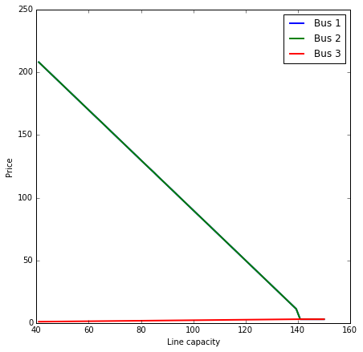

Static power flow
=================

.. code:: python

    %matplotlib inline
    import matplotlib.pyplot as plt
    import matplotlib
    import numpy as np
    
    from dem import *
    
    matplotlib.rc("figure", figsize=(7,7))
    matplotlib.rc("lines", linewidth=2)

Basic examples
--------------

Hello world
~~~~~~~~~~~

.. code:: python

    load = FixedLoad(power=100)
    gen = Generator(power_max=1000, alpha=0.01, beta=100)
    net = Net([load.terminals[0], gen.terminals[0]])
    network = Group([load, gen], [net])
    
    network.init_problem()
    network.problem.solve()
    print network.results.summary()

.. parsed-literal::

    Terminal                  Power
    --------                  -----
    FixedLoad[0]           100.0000
    Generator[0]          -100.0000
    
    Net                       Price
    ---                       -----
    Net                    102.0001
    

Curtailable load
~~~~~~~~~~~~~~~~

.. code:: python

    load = CurtailableLoad(power=1000, alpha=150)
    gen = Generator(power_max=1000, alpha=1, beta=100)
    net = Net([load.terminals[0], gen.terminals[0]])
    network = Group([load, gen], [net])
    
    network.init_problem()
    network.problem.solve()
    print network.results.summary()

.. parsed-literal::

    Terminal                  Power
    --------                  -----
    CurtailableLoad[0]      25.0026
    Generator[0]           -25.0026
    
    Net                       Price
    ---                       -----
    Net                    150.0000
    

Two generators, transmission line
~~~~~~~~~~~~~~~~~~~~~~~~~~~~~~~~~

.. code:: python

    load = FixedLoad(power=100)
    gen1 = Generator(power_max=1000, alpha=0.01, beta=100, name="Gen1")
    gen2 = Generator(power_max=100, alpha=0.1, beta=0.1, name="Gen2")
    line = TransmissionLine(power_max=50)
    
    net1 = Net([load.terminals[0], gen1.terminals[0], line.terminals[0]])
    net2 = Net([gen2.terminals[0], line.terminals[1]])
    network = Group([load, gen1, gen2, line], [net1, net2])
    
    network.init_problem()
    network.problem.solve()
    print network.results.summary()

.. parsed-literal::

    Terminal                  Power
    --------                  -----
    FixedLoad[0]           100.0000
    TransmissionLine[0]    -50.0000
    TransmissionLine[1]     50.0000
    Gen2[0]                -50.0000
    Gen1[0]                -50.0000
    
    Net                       Price
    ---                       -----
    Net                    101.0000
    Net                     10.1000
    

Three buses
~~~~~~~~~~~

Figure 2.1 from Kraning, et al. without the battery.

.. figure:: ./three_bus.png
   :alt: Three bus example

   Three bus example

.. code:: python

    load1 = FixedLoad(power=50, name="Load1")
    load2 = FixedLoad(power=100, name="Load2")
    gen1 = Generator(power_max=1000, alpha=0.01, beta=100, name="Gen1")
    gen2 = Generator(power_max=100, alpha=0.1, beta=0.1, name="Gen2")
    line1 = TransmissionLine(power_max=50)
    line2 = TransmissionLine(power_max=10)
    line3 = TransmissionLine(power_max=50)
    
    net1 = Net([load1.terminals[0], gen1.terminals[0], line1.terminals[0], line2.terminals[0]])
    net2 = Net([load2.terminals[0], line1.terminals[1], line3.terminals[0]])
    net3 = Net([gen2.terminals[0], line2.terminals[1], line3.terminals[1]])
    network = Group([load1, load2, gen1, gen2, line1, line2, line3], [net1, net2, net3])
    
    network.init_problem()
    network.problem.solve()
    print network.results.summary()

.. parsed-literal::

    Terminal                  Power
    --------                  -----
    TransmissionLine[1]     50.0000
    TransmissionLine[0]    -10.0000
    Gen2[0]                -60.0000
    Gen1[0]                -90.0000
    TransmissionLine[0]     50.0000
    TransmissionLine[1]    -50.0000
    Load2[0]               100.0000
    Load1[0]                50.0000
    TransmissionLine[1]     10.0000
    TransmissionLine[0]    -50.0000
    
    Net                       Price
    ---                       -----
    Net                    101.8008
    Net                    196.1907
    Net                     12.0975
    

Grouping devices
----------------

We can wrap up several devices and nets into a single device

.. code:: python

    solar = Generator(power_max=10, alpha=0, beta=0, name="Solar")
    load = FixedLoad(power=13)
    line = TransmissionLine(power_max=25)
    net = Net([load.terminals[0], solar.terminals[0], line.terminals[0]])
    home = Group([solar, load, line], [net], [line.terminals[1]], name="Home")
    
    grid = Generator(power_max=1e6, alpha=0.05, beta=100, name="Grid")
    meter = Net([line.terminals[1], grid.terminals[0]], name="Meter")
    network = Group([home, grid], [meter])
    
    network.init_problem()
    network.problem.solve()
    print network.results.summary()

.. parsed-literal::

    Terminal                  Power
    --------                  -----
    FixedLoad[0]            13.0000
    TransmissionLine[1]      3.0000
    Solar[0]               -10.0000
    Grid[0]                 -3.0000
    TransmissionLine[0]     -3.0000
    
    Net                       Price
    ---                       -----
    Net                    100.3000
    Meter                  100.3000
    

Varying parameters
------------------

We can modify a single parameter and reoptimize, which is useful for
sweeping over a parameter range.

.. code:: python

    load1 = FixedLoad(power=50, name="Load1")
    load2 = FixedLoad(power=100, name="Load2")
    gen1 = Generator(power_max=100, alpha=1, beta=10, name="Gen1")
    gen2 = Generator(power_max=1000, alpha=0.01, beta=0, name="Gen2")
    line1 = TransmissionLine(power_max=100)
    line2 = TransmissionLine(power_max=10)
    line3 = TransmissionLine(power_max=Parameter(1))
    
    net1 = Net([load1.terminals[0], gen1.terminals[0], line1.terminals[0], line2.terminals[0]])
    net2 = Net([load2.terminals[0], line1.terminals[1], line3.terminals[0]])
    net3 = Net([gen2.terminals[0], line2.terminals[1], line3.terminals[1]])
    network = Group([load1, load2, gen1, gen2, line1, line2, line3], [net1, net2, net3])
    
    network.init_problem()
    xs = np.linspace(0, 150, 100)
    prices = np.empty((len(xs), 3))
    for i, x in enumerate(xs):
        line3.power_max.value = x
        network.problem.solve()
        prices[i,:] = [net.price for net in network.nets]
        
    plt.plot(xs, prices)
    plt.xlabel("Line capacity")
    plt.ylabel("Price")
    plt.legend(["Bus 1", "Bus 2", "Bus 3"])

.. parsed-literal::

    <matplotlib.legend.Legend at 0x1103feb90>

