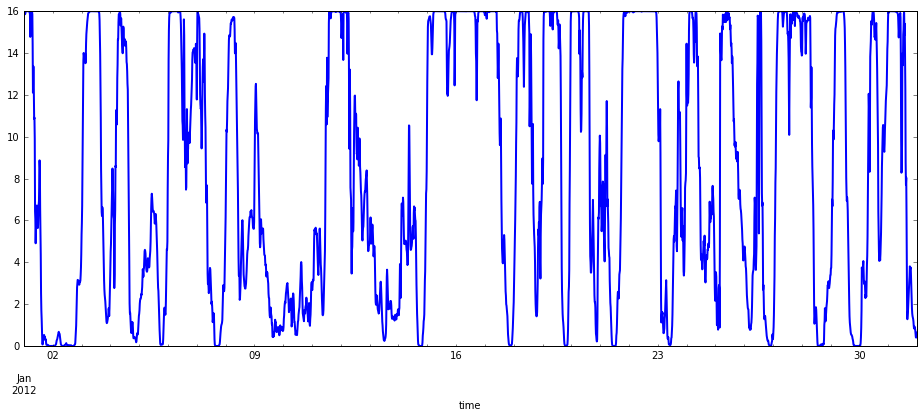
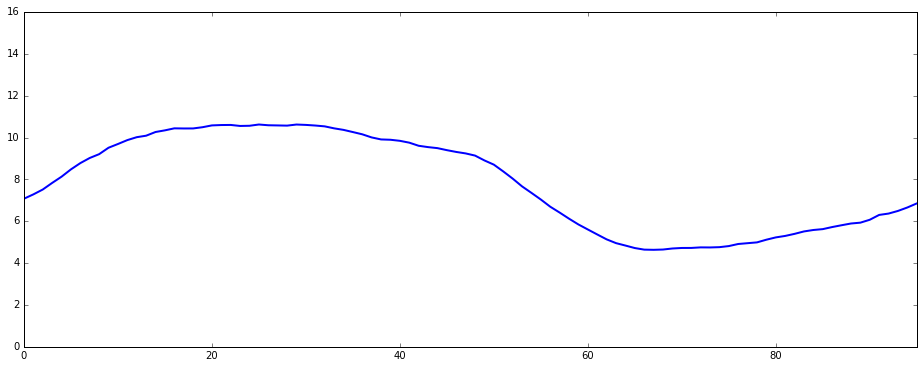
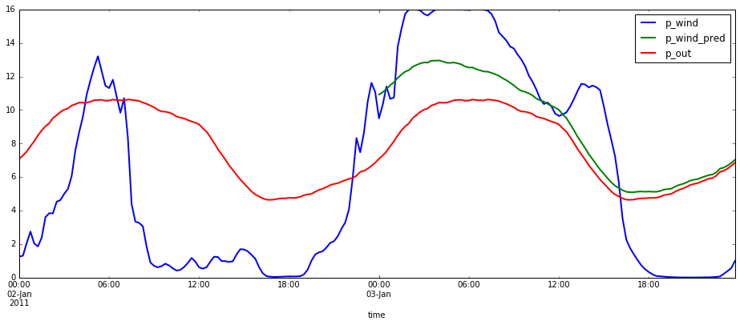
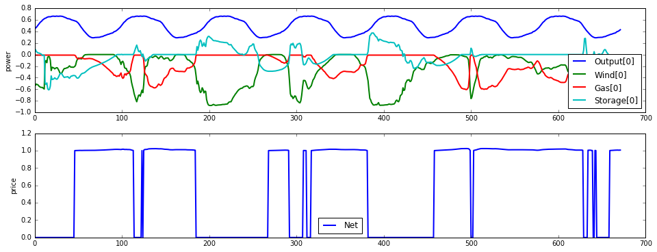
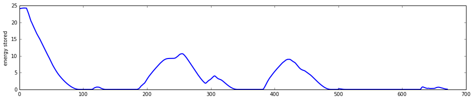
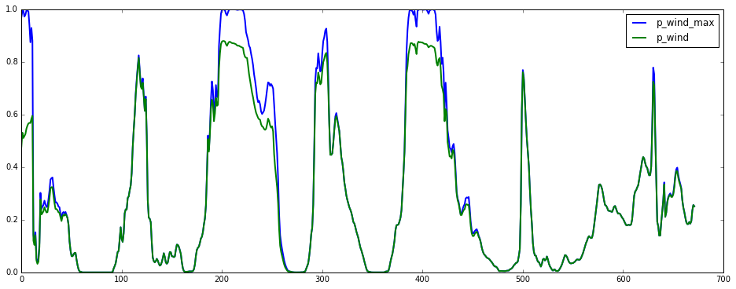

Wind farm integration
=====================

An example of a wind farm offering firm power by estimating the expected
wind resource and then using a MPC to jointly optimize control of a
small gas turbine and storage.

.. code:: python

    %matplotlib inline
    import datetime
    import pandas as pd
    import matplotlib
    import numpy as np
    import cvxpy as cvx
    from matplotlib import pyplot as plt
    
    from dem import *
    
    matplotlib.rc("figure", figsize=(16,6))
    matplotlib.rc("lines", linewidth=2)

Wind resource
-------------

Data is from `NREL wind integration
dataset <http://www.nrel.gov/electricity/transmission/wind_toolkit.html>`__,
site 20182.

.. code:: python

    def read_wind_csv(filename):
        df = pd.read_csv(
            filename, 
            skiprows=3, 
            parse_dates=[[0,1,2,3,4]],
            date_parser=lambda *cols: datetime.datetime(*map(int, cols)),
            index_col=0)
        df.index.name = "time"
        return df
    
    wind = pd.concat([
            read_wind_csv("nrel_wind/20182-2011.csv"),
            read_wind_csv("nrel_wind/20182-2012.csv")])
    p_wind = wind["power (MW)"].resample("15min").mean()
    p_wind["2012-01"].plot()

.. parsed-literal::

    <matplotlib.axes._subplots.AxesSubplot at 0x100fe1610>

Power blocks
~~~~~~~~~~~~

The amount of power offered for sale

.. code:: python

    def interval_of_day(dt):
        return dt.hour*4 + dt.minute/15
    
    # compute target output
    p_wind_by_interval = p_wind.groupby(interval_of_day(p_wind.index)).mean()
    p_wind_mean = pd.Series([p_wind_by_interval[interval_of_day(x)] for x in p_wind.index], index=p_wind.index)
    
    p_wind_by_interval.plot()
    plt.ylim([0,16])

.. parsed-literal::

    (0, 16)

MPC
---

Autoregressive model
~~~~~~~~~~~~~~~~~~~~

.. code:: python

    from sklearn import linear_model
    
    H = 4*6
    p_wind_residual = p_wind - p_wind_mean
    X = np.hstack([p_wind_residual.shift(x).fillna(0).reshape(-1,1) for x in xrange(1,H+1)])
    lr = linear_model.RidgeCV()
    lr.fit(X, p_wind_residual)
    
    def predict_wind(t, T):
        r = np.zeros(T)
        x = X[t,:]
        for i in xrange(T):
            tau = t+i
            r[i] = lr.predict(x.reshape(1,-1))
            x = np.hstack((r[i], x[:-1]))
        return np.maximum(p_wind_mean[t:t+T] + r, 0)
    
    t = 4*24*2
    T = 4*24
    compare = pd.DataFrame(index=p_wind.index)
    compare["p_wind"] = p_wind
    compare["p_wind_pred"] = pd.Series(predict_wind(t, T), index=p_wind.index[t:t+T])
    compare["p_out"] = p_wind_mean
    compare["2011-01-02":"2011-01-03"].plot()

.. parsed-literal::

    <matplotlib.axes._subplots.AxesSubplot at 0x13962d190>

.. code:: python

    from dem import network
    from dem import devices
    reload(network)
    reload(devices)
    
    CurtailableLoad = devices.CurtailableLoad
    DeferrableLoad = devices.DeferrableLoad
    FixedLoad = devices.FixedLoad
    Generator = devices.Generator
    Group = network.Group
    Net = network.Net
    Storage = devices.Storage
    ThermalLoad = devices.ThermalLoad
    TransmissionLine = devices.TransmissionLine
    
    run_mpc = network.run_mpc

.. code:: python

    T = 4*24
    out = FixedLoad(power=Parameter(T+1), name="Output")
    wind_gen = Generator(alpha=0, beta=0, power_min=0, power_max=Parameter(T+1), name="Wind")
    gas_gen = Generator(alpha=0.02, beta=1, power_min=0.01, power_max=1, name="Gas")
    storage = Storage(discharge_max=1, charge_max=1, energy_max=12*4, energy_init=Parameter(1, value=6*4))
    net = Net([wind_gen.terminals[0], 
               gas_gen.terminals[0],
               storage.terminals[0], 
               out.terminals[0]])
    network = Group([wind_gen, gas_gen, storage, out], [net])
    network.init_problem(time_horizon=T+1)
    
    def predict(t):
        out.power.value = p_wind_mean[t:t+T+1].as_matrix()/16
        wind_gen.power_max.value = np.hstack((p_wind[t], predict_wind(t+1,T)))/16
    
    def execute(t):
        energy_stored[t] = storage.energy.value[0]
        storage.energy_init.value = storage.energy.value[0]
    
    N = 4*24*7
    energy_stored = np.empty(N)
    results = run_mpc(network, N, predict, execute)

.. parsed-literal::

    100%|██████████| 672/672 [00:33<00:00, 20.31it/s]

.. code:: python

    # plot the results
    results.plot()
    
    # plot energy stored in battery
    fig, ax = plt.subplots(nrows=1, ncols=1, figsize=(16,3))
    ax.plot(energy_stored)
    ax.set_ylabel("energy stored")

.. parsed-literal::

    <matplotlib.text.Text at 0x15d0bccd0>

Wind curtailment
~~~~~~~~~~~~~~~~

Current model is not too smart about using all the available wind power,
at times it doesn't even charge the battery when there is extra power
available...

.. code:: python

    plt.plot(xrange(N), p_wind[:N]/16, label="p_wind_max")
    plt.plot(-results.power[(wind_gen, 0)], label="p_wind")
    plt.legend()

.. parsed-literal::

    <matplotlib.legend.Legend at 0x15ca9e710>

